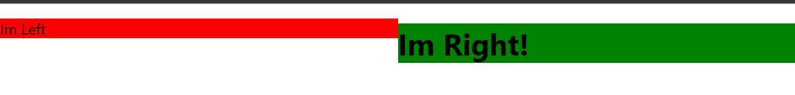
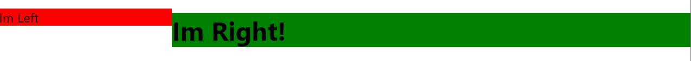

### LAYOUT COMPONENTS

- primary concern: arrange other components in the screen
- Examples: Split Screens, Lists and Items, Modals

## Normally without Layout Components

```react
  <div styles={...}>
    <h1>Component Code...</h1>
  </div>
```

### With Layout Components

## We separate the actual layout styles into their own component and then simply display the component itself

---

## The Idea of Layout Components:

### **our components shouldn't know where they're being displayed**

---

## Creating Split Screen

1. Install Styled Components

- `npm install styled-components`

2. Create new file

**`SplitScreen.js`**

```js
import styled from "styled-components";

const Container = styled.div`
  display: flex;
`;

const Pane = styled.div`
  flex: 1;
`;

export const SplitScreen = ({ left: Left, right: Right }) => {
  return (
    <Container>
      <Pane>
        <Left />
      </Pane>
      <Pane>
        <Right />
      </Pane>
    </Container>
  );
};
```

3. Create the consumer of the `SplitScreen` layout component

```js
import { SplitScreen } from "./SplitScreen";

const LeftHandComponent = () => {
  return <h1>Left!</h1>;
};

const RightHandComponent = () => {
  return <p>Right!</p>;
};

const App = () => {
  return <SplitSCreen left={LeftHandComponent} right={RightHandComponent} />;
};
```

4. Now run the app from the root directory
   `npm start`
   

---

## Creating weighted SplitScreen

1. modify the split screen

```js
import styled from "styled-components";

const Container = styled.div`
  display: flex;
`;

const Pane = styled.div`
  flex: ${(props) => props.weight};
`;

export const SplitScreen = ({
  left: Left, // this is just renaming left to Left
  right: Right,
  leftWeight = 1,
  rightWeight = 1,
}) => {
  return (
    <Container>
      <Pane weigth={leftWeight}>
        <Left />
      </Pane>
      <Pane weigth={rightWeight}>
        <Right />
      </Pane>
    </Container>
  );
};
```

2. Modify the driver class

```js
import { SplitScreen } from "./SplitScreen";

const LeftHandComponent = () => {
  return <h1>Left!</h1>;
};

const RightHandComponent = () => {
  return <p>Right!</p>;
};

const App = () => {
  return (
    <SplitSCreen
      left={LeftHandComponent}
      right={RightHandComponent}
      leftWeight={1}
      rightWeight={3}
    />
  );
};
```

3. Output:



---

## Optimization: Instead of Passing Components as Props, we will use them as Children

1. Modify the SplitScreen layout component

```js
import styled from "styled-components";

const Container = styled.div`
  display: flex;
`;

const Pane = styled.div`
  flex: ${(props) => props.weight};
`;

export const SplitScreen = ({ children, leftWeight = 1, rightWeight = 1 }) => {
  // since children is an array
  // notice that we are using 'left' and not 'Left'
  // since these are elements, not components
  const [left, right] = children;

  return (
    <Container>
      <Pane weigth={leftWeight}>{left}</Pane>
      <Pane weigth={rightWeight}>{right}</Pane>
    </Container>
  );
};
```

2. Modify the driver

```js
import { SplitScreen } from "./SplitScreen";

const LeftHandComponent = () => {
  return <h1>Left!</h1>;
};

const RightHandComponent = () => {
  return <p>Right!</p>;
};

const App = () => {
  return (
    <SplitScreen
      leftWeight={1}
      rightWeight={3}
    />
      <LeftHandComponent />
      <RightHandComponent />
    <SplitScreen>
  );
};
```
